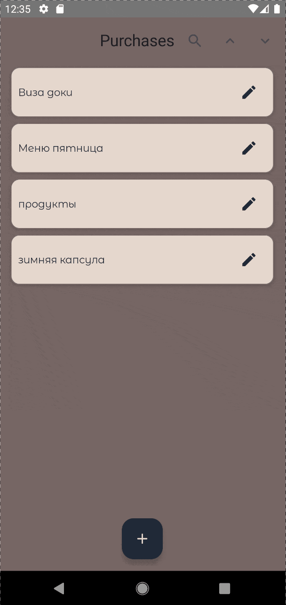

# Purchases

[](https://github.com/vkozhanova/Purchases/actions/workflows/ci.yml)
Android-приложение для списков, разработанное с использованием Jetpack Compose и современных компонентов Android Jetpack.
## Возможности
- Создание, редактирование названия списков
- Копирование, поиск и удаление списков
- Просмотр, копирование и удаление пунктов списка
- Экспорт списка

## Demo
<table>
<tr>
<td align="center"><b>All Lists</b></td>
</tr>
<tr>
<td></td>
</tr>
</table>

## Реализовано
- современный UI на Jetpack Compose;
- разделение приложения по принципу MVVM;
- автоматическое внедрение зависимостей;
- автоматическая сборка и тестирование через GitHub Actions

## Технологии
- Kotlin
- Jetpack Compose
- Material 3
- Coroutines + Flow
- Hilt
- Navigation Compose
- Kotlinx Serialization
- Room

## Архитектура
Для упрощения поддержки и масштабирования код разделён на feature-пакеты по функциональным областям:
```
features/
    items/
    lists/
```

## Структура проекта
```
app
├── core
│   └── navigation
├── data
│   ├── database
│   └── repository
├── domain
│   └── export
├── di
├── features
│   ├── items
│   └── lists
└── ui
```
## Тестирование
В проекте реализованы:
- Unit-тесты
- Instrumentation-тесты

## CI
Для проекта настроен GitHub Actions.
При каждом push и pull request автоматически выполняются:
- сборка проекта;
- запуск unit- и instrumentation-тестов;
- проверка успешности сборки.
## Запуск проекта
1. Клонируйте репозиторий:
```bash
git clone https://github.com/vkozhanova/Purchases.git
```
2. Откройте проект в Android Studio.
3. Дождитесь синхронизации Gradle.
4. Запустите приложение на эмуляторе или физическом устройстве.
---
## Автор
**Vera Kozhanova**

GitHub: [@vkozhanova](https://github.com/vkozhanova)

лого прилодения принадлежит <a target="_blank" href="https://icons8.com/icon/cGcRDueIKQkF/task">заметки</a> icon by <a target="_blank" href="https://icons8.com">Icons8</a>